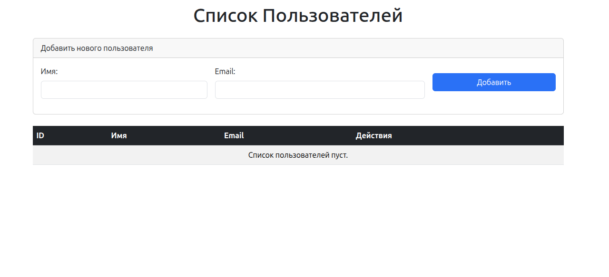
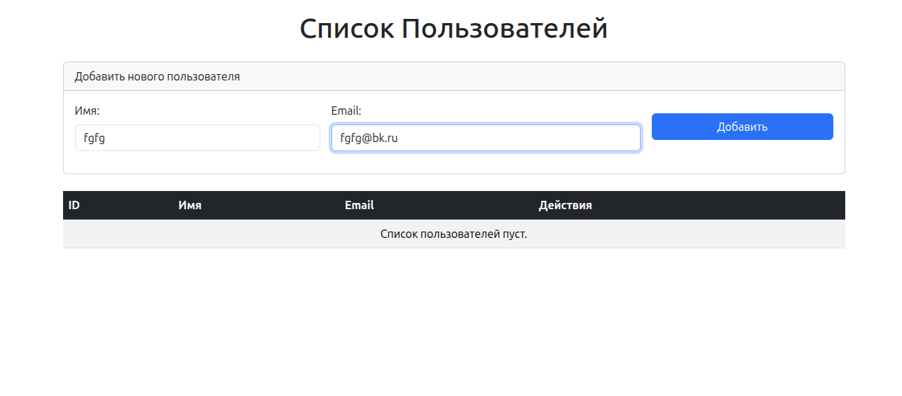
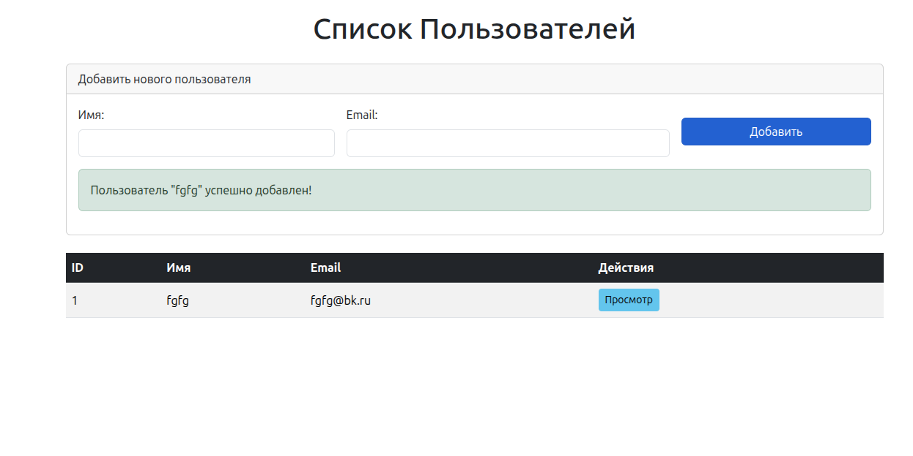
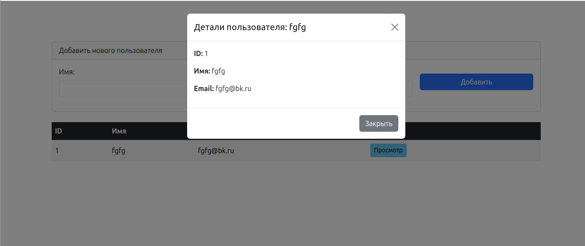

# User_manager

Приложение `User_manager` - простое веб-приложение для управления пользователями, состоящее из бэкенда на Python (Flask) и фронтенда на JavaScript (vanilla JS).

## Описание работы

Приложение позволяет:

1.  **Управление Пользователями (Бэкенд):**
    *   Хранить информацию о пользователях (ID, имя, email) в базе данных SQLite.
    *   Получать список всех пользователей через эндпоинт `/users` (GET).
    *   Получать информацию о конкретном пользователе по его ID через эндпоинт `/users/<id>` (GET).
    *   Обрабатывать ошибки, например, при отсутствии пользователя с указанным ID.

2.  **Отображение Пользователей (Фронтенд):**
    *   Использовать Fetch API для взаимодействия с бэкендом.
    *   Отображать список пользователей в удобной таблице.
    *   Показывать детальную информацию о выбранном пользователе во всплывающем модальном окне.
    *   Использовать Bootstrap для стильного и адаптивного интерфейса.

3.  **Добавление Пользователей (Интеграция):**
    *   Предоставлять форму для добавления новых пользователей.
    *   Отправлять данные новых пользователей на бэкенд через Fetch API.
    *   Автоматически обновлять список пользователей на странице после успешного добавления, без необходимости перезагрузки.
    *   Отображать уведомления об успехе или ошибке добавления.

## Примеры работы

**Главная страница:**


**Добавление нового пользователя и успешное добавление:**



**Модальное окно с информацией о пользователе:**



## Структура проекта

*   `backend/` - директория с файлами бэкенда на Flask.
    *   `migrations` - миграции базы данных (появится после инициализации миграций базы данных).
    *   `gitignore` -  файл в системе контроля версий Git, который определяет игнорируемые файлы и каталоги.
    *   `app.py` - основной файл приложения Flask.
    *   `database.db` - файл базы данных SQLite (появится после инициализации миграций базы данных).
    *   `requirements.txt` - файл, который содержит список зависимостей проекта (библиотек) и их версий.
*   `frontend/` - директория с файлами фронтенда.
    *   `index.html` - главная HTML страница.
    *   `script.js` - JavaScript код для фронтенда.
    

## Как запустить

**Предварительные условия:**

*   Установленный Python 3.12.
*   Установленный менеджер пакетов pip.

**Шаги:**

1.  **Клонируйте репозиторий:**
    ```bash
    git clone <>
    cd <>
    ```

2.  **Настройте и запустите бэкенд:**
    *   Перейдите в директорию бэкенда:
        ```bash
        cd backend
        ```
    *   Создайте и активируйте виртуальное окружение (рекомендуется):
        ```bash
        python -m venv venv
        # Для Windows:
        .\venv\Scripts\activate
        # Для macOS/Linux:
        source venv/bin/activate
        ```
    *   Установите необходимые зависимости:
        ```bash
        pip install -r requirements.txt
        ```
    *   Выполните инициализацию миграций:
        ```bash
        flask db init
        ```
    *   Сгенерируйте начальный скрипт миграции:
        ```bash
        flask db migrate -m "Initial migration"
        ```
    *   Примените миграцию к базе данных:
        ```bash
        flask db upgrade
        ```
    *   Запустите Flask-приложение:
        ```bash
        python app.py
        ```
    *   Бэкенд будет доступен по адресу `http://127.0.0.1:5000`.

3.  **Запустите фронтенд:**
    *   Откройте файл `frontend/index.html` в вашем веб-браузере.


## Дополнительно
Автором проекта является: [Иванова Александра](https://github.com/AleksandraIvanova90)

